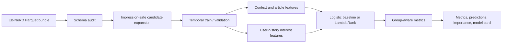

# News CTR Ranking

Leakage-safe news click ranking with temporal validation, personalized content features, and impression-grouped evaluation.

This repository is a portfolio-grade machine-learning study built around the [EB-NeRD news recommendation dataset](https://recsys.eb.dk/). It focuses on a deceptively important question:

> Given the user, context, click history, and news articles shown in one impression, which candidate should rank first?

The emphasis is not a leaderboard score. It is a trustworthy experimental system that makes its assumptions visible: candidates stay inside their original impression, validation happens after training in time, user and article IDs are excluded from the model, and aggregate features with potentially future information are deliberately omitted.

## What this project demonstrates

- Correctly framing click prediction as an impression-level ranking task.
- Converting EB-NeRD's nested Parquet logs into auditable candidate rows.
- Combining context, article metadata, category affinity, and TF-IDF/SVD text similarity.
- Comparing an interpretable logistic baseline with optional LightGBM LambdaRank.
- Evaluating with group AUC, MRR, NDCG@5, and NDCG@10 instead of global accuracy.
- Producing reproducible JSON, Parquet, CSV, and Markdown artifacts from a CLI.
- Testing data contracts, temporal separation, feature leakage, metrics, models, and the full workflow.

## Architecture



The core is ordinary Python rather than notebook-only state. Every experiment can be rerun from a clean shell and produces an independent prediction table for metric reproduction.

## Quick start

Python 3.10 or newer is required.

```bash
python -m venv .venv
source .venv/bin/activate
python -m pip install -e ".[dev]"

news-ctr make-synthetic --output data/synthetic --seed 42
news-ctr audit --data data/synthetic --split train
news-ctr train \
  --data data/synthetic \
  --output artifacts/my-run \
  --model logistic \
  --seed 42 \
  --text-components 16
```

The run writes:

```text
artifacts/my-run/
├── metrics.json
├── predictions.parquet
├── feature_importance.csv
├── run_config.json
└── model_card.md
```

For LambdaRank, install the optional native dependency and change the model flag:

```bash
python -m pip install -e ".[dev,ranking]"
news-ctr train --data data/synthetic --output artifacts/ranker --model lightgbm
```

LightGBM requires an OpenMP runtime. On macOS, install `libomp` with your system package manager if the CLI reports that it is missing. The repository's ranking-extra CI job trains the LambdaRank path on Linux.

## Using EB-NeRD

Download the demo, small, or large bundle from the [official EB-NeRD site](https://recsys.eb.dk/) after reviewing and accepting its license. This repository does not redistribute the dataset.

Arrange the files as follows:

```text
data/ebnerd_demo/
├── articles.parquet
├── train/
│   ├── behaviors.parquet
│   └── history.parquet
└── validation/
    ├── behaviors.parquet
    └── history.parquet
```

Then run:

```bash
news-ctr audit --data data/ebnerd_demo --split train
news-ctr audit --data data/ebnerd_demo --split validation
news-ctr train --data data/ebnerd_demo --output artifacts/ebnerd-logistic
```

See [docs/data.md](docs/data.md) for the accepted schema and [docs/experiment-protocol.md](docs/experiment-protocol.md) before interpreting a result.

## Feature families

| Family | Examples | Leakage decision |
| --- | --- | --- |
| Context | hour, weekday, device, candidate position | Available at impression time |
| Article | age, category, premium, type, sentiment | Publication age is calculated from the impression timestamp |
| User history | history length, category affinity | Built only from supplied prior click history |
| Semantic match | history–candidate and recent–candidate similarity | TF-IDF/SVD is fitted on training-visible article text |

Raw `user_id`, `article_id`, and `impression_id` never enter the model. EB-NeRD fields such as `total_inviews`, `total_pageviews`, and `total_read_time` are also excluded: their seven-day windows may contain outcomes that were not yet observable at an earlier impression.

## Evaluation

All ranking metrics are computed within an impression and then averaged:

- **Group AUC:** discrimination among candidates in impressions containing both labels.
- **MRR:** reciprocal rank of the first clicked article.
- **NDCG@5 / NDCG@10:** ranking quality with logarithmic position discount.
- **Log loss:** probability quality for the logistic baseline.

Single-class impressions are excluded from group AUC and counted explicitly. They still contribute zero to MRR and NDCG if they contain no click.

## Reproducible smoke result

The committed [synthetic smoke artifacts](artifacts/synthetic-smoke/) were generated with seed 42, 180 impressions, and logistic regression:

| Metric | Value |
| --- | ---: |
| Group AUC | 0.7611 |
| MRR | 0.6468 |
| NDCG@5 | 0.7146 |
| NDCG@10 | 0.7344 |
| Log loss | 0.6418 |

These values are an **engineering smoke test on synthetic data**, not an EB-NeRD benchmark. The synthetic generator intentionally makes category affinity, content similarity, freshness, and position predictive so that broken feature or training pipelines are observable.

## Leakage and validity checklist

- [x] Negative examples come only from the same observed impression.
- [x] Train timestamps end strictly before validation timestamps begin.
- [x] Text vocabulary and imputers are fitted on training-visible data.
- [x] Raw entity IDs are excluded from the feature matrix.
- [x] Prediction artifacts retain group IDs for independent metric reproduction.
- [x] Random seeds and dataset fingerprints are recorded.
- [x] Synthetic and real-data results are clearly distinguished.

## Repository map

```text
src/news_ctr/
├── data.py       # loading, audit, expansion, temporal split, synthetic data
├── features.py   # structured and text-based personalization features
├── models.py     # logistic and optional LightGBM adapters
├── metrics.py    # impression-grouped AUC, MRR, and NDCG
├── reporting.py  # reproducibility artifacts and model cards
└── cli.py        # audit, make-synthetic, and train commands
tests/            # behavior-focused unit and end-to-end tests
docs/             # data contract and experimental protocol
```

## Limitations and next experiments

- Click logs contain exposure and position bias; offline association is not causality.
- The baseline treats each candidate independently except during metric calculation.
- New validation users receive zero-history representations when absent from training history.
- Danish language modeling is deliberately lightweight and CPU-friendly.
- Diversity, novelty, fairness, calibration by segment, and editorial values are not optimized.

High-value follow-ups are a time-aware popularity baseline, inverse-propensity weighting, validation-time history snapshots, LambdaRank ablations, and EB-NeRD's released multilingual embeddings.

## Interview discussion prompts

- Why does a random row split leak information in recommendation logs?
- Why is global ROC AUC insufficient when the product ranks candidates per impression?
- How would position bias change the label interpretation and offline evaluation?
- Which aggregate article features are unsafe at prediction time, and how would you rebuild them?
- When should a pointwise classifier be replaced by pairwise or listwise learning to rank?

## 中文简介

这是一个面向求职作品集的新闻点击排序项目。它重点展示数据契约、时间切分、特征工程、文本语义匹配、Learning to Rank 和分组评估，而不是简单套用一个分类模型。仓库内不包含 EB-NeRD 原始数据；合成数据成绩只用于证明工程链路可运行，不能视为真实推荐效果。

## License and attribution

Original code is released under the [MIT License](LICENSE). EB-NeRD has its own license and citation requirements; see [CITATION.cff](CITATION.cff) and the official dataset site before publishing derived research results.
