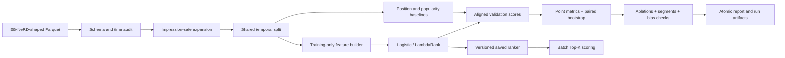

# News CTR Ranking

[](https://github.com/1327402913-pixel/news-ctr-ranking/actions/workflows/publish.yml)

Leakage-safe news recommendation benchmark with temporal validation, personalized
content features, learning-to-rank, uncertainty estimates, and reusable batch scoring.

> **Evidence boundary:** every number shown below comes from deterministic synthetic
> data. It proves that the engineering and evaluation workflow runs end to end; it is
> **not an EB-NeRD benchmark, production result, or claim of online CTR lift**.

## 60-second project tour

**Business question:** given a user, their prior reading history, the request context,
and the articles shown in one impression, which candidate should rank first?

The repository turns nested EB-NeRD-shaped Parquet logs into one auditable experiment:

1. validate the data contract and preserve complete impression groups;
2. split training and validation strictly by time;
3. fit context, article, history-affinity, and text-similarity features on
   training-visible data;
4. compare position, training-only popularity, logistic regression, and LightGBM
   LambdaRank on the same validation impressions;
5. report group AUC, MRR, NDCG, paired 95% bootstrap intervals, ablations, segments,
   exposure-bias diagnostics, latency, and model size;
6. save a versioned ranker and use it for label-free batch Top-K scoring.

### Latest reproducible synthetic evidence

Seed 42, 180 impressions, 200 paired impression-bootstrap samples:

| Rank | Approach | Group AUC | MRR | NDCG@5 | NDCG@10 |
| ---: | --- | ---: | ---: | ---: | ---: |
| 1 | Logistic regression | 0.772222 | 0.653704 | 0.720183 | 0.739972 |
| 2 | LightGBM LambdaRank | 0.750000 | 0.609259 | 0.697030 | 0.706924 |
| 3 | Position diagnostic | 0.616667 | 0.487037 | 0.553516 | 0.612884 |
| 4 | Smoothed popularity | 0.555556 | 0.447222 | 0.541418 | 0.580996 |

The logistic point estimate is **+0.127088 NDCG@10** above the position diagnostic.
Their 95% bootstrap intervals are `[0.651928, 0.809344]` and
`[0.547920, 0.679103]`, which overlap slightly; the result is useful pipeline evidence,
not a significance or production claim. Logistic and LightGBM intervals overlap more
substantially, so this synthetic run does not establish that one generalizes better.

Read the generated [full benchmark report](artifacts/portfolio-v2/benchmark_report.md)
or inspect the [leaderboard](artifacts/portfolio-v2/leaderboard.csv),
[confidence intervals](artifacts/portfolio-v2/confidence_intervals.csv), and
[ablations](artifacts/portfolio-v2/ablations.csv).

The fixed logistic ablation gives a compact view of what the synthetic run actually
supports:

| Ablation | Features | NDCG@10 | Δ vs full |
| --- | ---: | ---: | ---: |
| Context only | 9 | 0.612884 | -0.127088 |
| No position | 20 | 0.672726 | -0.067246 |
| No semantic similarity | 19 | 0.739972 | 0.000000 |
| No personalization | 19 | 0.739972 | 0.000000 |
| Full | 21 | 0.739972 | 0.000000 |

The zero deltas do not prove semantic or personalization features are useless; they
show only that this deterministic synthetic validation slice provides no incremental
evidence for them beyond the correlated features already present.

### Three engineering decisions

| Decision | Technical reason | Product implication |
| --- | --- | --- |
| Keep candidates inside their original impression | Global classification metrics do not represent a ranking surface | Evaluation matches the decision the product actually makes |
| Fit every learned transform on training-visible data | Random row splitting and future aggregates can leak outcomes | Offline gains are less likely to be artifacts of future information |
| Report baselines, uncertainty, and slices together | A single best score hides variance and exposure bias | Reviewers can judge robustness, cost, and failure modes instead of one headline number |

### Resume bullets you can adapt

- Built a leakage-aware news ranking benchmark in Python that compares four approaches
  on shared temporal splits and reports impression-level AUC, MRR, NDCG, paired
  bootstrap intervals, feature ablations, and segment diagnostics.
- Productized the offline workflow as a tested CLI with schema audits, atomic benchmark
  publication, versioned model artifacts, deterministic Top-K batch inference, and CI
  across Python 3.10–3.12 plus LightGBM on Linux.

## Architecture



The implementation is ordinary Python rather than notebook-only state. Metric tables
are regenerated from aligned candidate scores, and a failed benchmark never publishes
a partially complete output directory.

## Quick start

Python 3.10 or newer is required.

```bash
python -m venv .venv
source .venv/bin/activate
python -m pip install -e ".[dev]"

news-ctr make-synthetic --output data/synthetic --seed 42
news-ctr audit --data data/synthetic --split train
news-ctr benchmark \
  --data data/synthetic \
  --output artifacts/benchmark-core \
  --models position,popularity,logistic \
  --bootstrap-samples 200 \
  --seed 42
```

The same core workflow is available as `make benchmark`. The destination must not
already exist; this protects completed evidence from accidental overwrite. Set
`CORE_BENCHMARK_OUTPUT=...` when you want a different output path.

### Include LambdaRank

```bash
python -m pip install -e ".[dev,ranking]"
news-ctr benchmark \
  --data data/synthetic \
  --output artifacts/benchmark-ranking \
  --models position,popularity,logistic,lightgbm \
  --bootstrap-samples 200 \
  --seed 42
```

This is also `make benchmark-ranking`. LightGBM requires OpenMP; on macOS, install
`libomp` with your package manager if the CLI reports it missing. CI exercises the
full four-model path on Linux.

## Run on licensed EB-NeRD data

Download demo, small, or large data from the
[official EB-NeRD site](https://recsys.eb.dk/) after accepting its license. This
repository does not download or redistribute it. Arrange the bundle as documented in
[docs/data.md](docs/data.md), then run:

```bash
news-ctr audit --data data/ebnerd_demo --split train
news-ctr audit --data data/ebnerd_demo --split validation
news-ctr benchmark \
  --data data/ebnerd_demo \
  --output artifacts/ebnerd-demo-v1 \
  --models position,popularity,logistic,lightgbm \
  --bootstrap-samples 1000 \
  --seed 42
```

Do not copy the committed synthetic scores into a resume as EB-NeRD results. Generate
and review a licensed real-data report first.

## Train, persist, and rank

Train writes metrics, predictions, importance, a model card, `model.joblib`, and
`model_metadata.json`:

```bash
news-ctr train \
  --data data/synthetic \
  --output artifacts/logistic-run \
  --model logistic \
  --seed 42 \
  --text-components 16

news-ctr rank \
  --model artifacts/logistic-run/model.joblib \
  --candidates data/synthetic/validation/behaviors.parquet \
  --output artifacts/scored-validation.parquet \
  --top-k 5
```

The rank output contains only `impression_id`, `article_id`, `score`, and one-based
`rank`; labels are deliberately omitted. **Joblib uses pickle semantics and can execute
code while loading. Load only artifacts you created or otherwise trust.**

## Feature families and ablations

| Family | Examples | Leakage decision |
| --- | --- | --- |
| Context | hour, weekday, device, position, candidate count | Available at impression time; position is treated as a bias-sensitive feature |
| Article | age, category, premium, type, sentiment | Age is calculated from the impression timestamp |
| Personalization | history length, category affinity | Derived from supplied prior click history |
| Semantic | long-term and recent text similarity | TF-IDF/SVD vocabulary is fitted on training-visible article text |

The fixed logistic ablation matrix is `context_only`, `no_position`, `no_semantic`,
`no_personalization`, and `full`. Every model feature belongs to exactly one declared
group, so exclusions are testable rather than informal.

Raw `user_id`, `article_id`, and `impression_id` never enter the model. Article fields
such as `total_inviews`, `total_pageviews`, and `total_read_time` are excluded because
their aggregation windows may extend beyond an earlier impression.

## Evaluation contract

- **Group AUC:** pair discrimination within impressions containing both labels.
- **MRR:** reciprocal rank of the first clicked article.
- **NDCG@5 / NDCG@10:** top-weighted ranking quality.
- **Paired bootstrap:** whole impressions sampled with replacement; the same draws are
  reused across models.
- **Segments:** device, candidate-set size, and history-length slices retain complete
  impressions and flag fewer than five impressions as low support.
- **Candidate diagnostics:** position and freshness click rates are descriptive bias
  checks, not ranking metrics or causal estimates.

See [docs/experiment-protocol.md](docs/experiment-protocol.md) before interpreting a
real-data run.

## Repository map

```text
src/news_ctr/
├── data.py          # contracts, audit, expansion, temporal split, synthetic fixture
├── features.py      # leakage-aware transformations and feature-group registry
├── baselines.py     # position and training-only smoothed popularity
├── models.py        # logistic and optional LightGBM adapters
├── metrics.py       # impression-grouped AUC, MRR, and NDCG
├── evaluation.py    # paired bootstrap, ablations, segments, diagnostics
├── persistence.py   # versioned trusted ranker and batch scoring
├── benchmarking.py  # shared orchestration and atomic publication
├── reporting.py     # model cards and self-contained benchmark report
└── cli.py           # make-synthetic, audit, train, rank, benchmark
tests/               # behavior-focused unit and integration tests
artifacts/portfolio-v2/  # committed aggregate synthetic evidence
docs/                # data contract and experiment protocol
```

## Limitations and next evidence

- Click logs combine preference, exposure, and position bias; association is not
  causality.
- Synthetic data intentionally contains learnable patterns and cannot establish
  real-world ranking quality.
- Current text modeling is lightweight and CPU-oriented; neural recommenders are out
  of scope until a licensed real-data baseline is established.
- Offline metrics do not optimize diversity, novelty, fairness, editorial value, or
  online business outcomes.
- Validation-time evolving history, inverse-propensity correction, calibration, and
  online A/B testing remain future work.

## 中文简介

这是一个面向数据分析、机器学习和推荐算法求职的新闻排序项目。它不仅训练模型，还展示数据契约、严格时间切分、训练集统计基线、Learning to Rank、曝光组级置信区间、特征消融、分群诊断、模型持久化、批量 Top-K 推理与 CI。仓库中的成绩来自合成数据，只能证明工程链路可复现，不能作为真实 EB-NeRD 或线上业务效果。

## License and attribution

Original code is released under the [MIT License](LICENSE). EB-NeRD has its own license
and citation requirements; see [CITATION.cff](CITATION.cff) and the official dataset
site before publishing derived research results.
