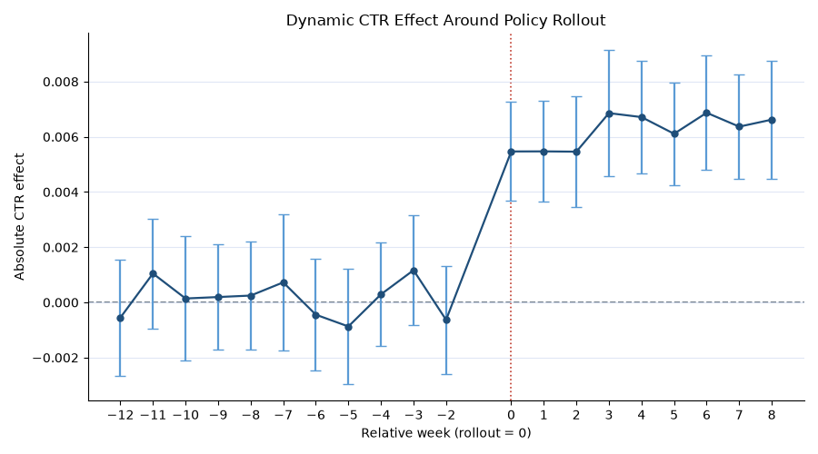
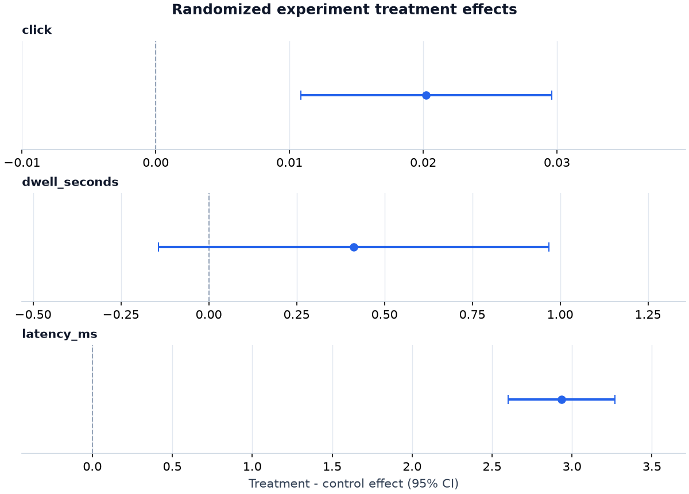
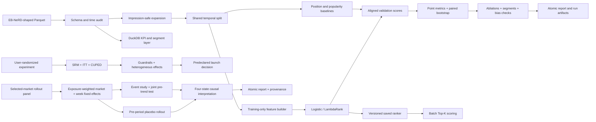

# News CTR Ranking

[](https://github.com/1327402913-pixel/news-ctr-ranking/actions/workflows/publish.yml)

End-to-end decision-science case study for a news product: DuckDB metric analysis,
leakage-safe recommendation ranking, randomized experimentation, causal effect
estimation, and a predeclared launch decision.

> **Evidence boundary:** every number shown below comes from deterministic synthetic
> data. It proves that the engineering and evaluation workflow runs end to end; it is
> **not an EB-NeRD benchmark, production result, or claim of online CTR lift**.

## 60-second project tour

**Business questions:** which article should rank first for this impression, and does a
new ranking treatment create enough incremental value to launch without harming
engagement or latency?

The repository turns nested EB-NeRD-shaped Parquet logs into one auditable experiment:

1. validate the data contract and preserve complete impression groups;
2. split training and validation strictly by time;
3. fit context, article, history-affinity, and text-similarity features on
   training-visible data;
4. compare position, training-only popularity, logistic regression, and LightGBM
   LambdaRank on the same validation impressions;
5. report group AUC, MRR, NDCG, paired 95% bootstrap intervals, ablations, segments,
   exposure-bias diagnostics, latency, and model size;
6. summarize product KPIs and segments through reviewed DuckDB SQL;
7. size and validate a user-randomized experiment, estimate ITT and CUPED effects,
   check guardrails, and apply a predeclared launch rule;
8. estimate a non-random market rollout with exposure-weighted Difference-in-Differences,
   market/week fixed effects, clustered inference, an event study, and a placebo;
9. save a versioned ranker and use it for label-free batch Top-K scoring.

## Causal Impact V4: observational rollout analysis

The V4 layer asks a distinct business question: **when a ranking policy is rolled out
to selected markets rather than randomized, is the observed CTR change consistent with
incremental impact?** It analyzes a deterministic synthetic panel of 60 markets over
20 pre-treatment and 12 post-treatment weeks. This demonstrates quasi-experimental
workflow design; it is **not production lift**.

| Check | Committed synthetic result | Interpretation |
| --- | ---: | --- |
| Exposure-weighted DiD | +0.6123 pp, 95% CI [0.5589, 0.6658] | Interval clears the predeclared +0.2 pp threshold |
| Parallel-trends joint test | p = 0.6314 across 11 leads | Does not reject zero pre-treatment lead effects |
| Placebo rollout at week -8 | -0.0115 pp, 95% CI [-0.0768, 0.0538] | Interval contains zero |
| Business translation | +6,123 clicks per 1,000,000 exposures | 95% interval [5,589, 6,658], with no revenue assumption |



The predeclared policy returns **`supports_incremental_impact`**. Treated markets have
substantially different pre-period levels by construction, illustrating non-random
rollout selection: market fixed effects absorb stable level differences, while week
fixed effects absorb shared shocks. Neither adjustment rules out differential,
time-varying confounding, so the conclusion remains conditional on parallel untreated
potential-outcome trends.

Read the [full causal report](artifacts/causal-impact-v4/causal_report.md),
[diagnostics](artifacts/causal-impact-v4/diagnostics.json),
[event-study estimates](artifacts/causal-impact-v4/event_study.csv), and
[run manifest](artifacts/causal-impact-v4/run_manifest.json). The concise
[interview brief](docs/causal-impact-brief.md) explains the design and limitations.

### RCT versus quasi-experimental evidence

| Question | Randomized V3 | Quasi-experimental V4 |
| --- | --- | --- |
| Assignment | User-level 50/50 randomization | Selected-market common rollout |
| Estimand | User-level intent-to-treat difference | Exposure-weighted treated-versus-control change |
| Core assumptions | Valid randomization, SUTVA | Parallel trends, no anticipation, no spillovers |
| Main diagnostics | SRM, CUPED, guardrails | Event-study leads, placebo rollout, pre-period balance |
| Strongest claim here | Decision-code behavior on synthetic RCT data | Identification-workflow behavior on synthetic panel data |

## Decision Science V3: from metric to launch decision

The V3 layer answers a question that offline model scores cannot: **if the new ranking
experience were randomized, would the evidence justify launch?** The committed run is
a deterministic 20,000-user synthetic RCT used to prove the analysis workflow. It is
**not production lift**.

### Product metric layer

The SQL layer exposes numerators and denominators, runs data-quality checks, builds an
exposure funnel, and reports device, position, slate-size, history, and freshness
segments. On the fixed synthetic validation slice:

| KPI | Value | Definition |
| --- | ---: | --- |
| Active users | 30 | Distinct users with a validation impression |
| Impressions | 36 | Distinct recommendation requests |
| Candidate exposures | 216 | Articles shown across those requests |
| Clicks | 36 | Clicked candidate rows |
| Candidate CTR | 16.67% | Clicks / candidate exposures |

See the [SQL analytics report](artifacts/portfolio-v3/analytics_report.md),
[segment table](artifacts/portfolio-v3/segment_kpis.csv), and the reviewed queries in
[`src/news_ctr/sql`](src/news_ctr/sql).

### Randomized experiment evidence

| Check | Result | Decision interpretation |
| --- | ---: | --- |
| Sample ratio mismatch | p = 0.3806 | Pass; allocation is compatible with 50/50 |
| Raw click ITT | +2.02 pp, 95% CI [1.09, 2.96] | Positive user-level treatment effect |
| CUPED click ITT | +2.05 pp, 95% CI [1.12, 2.98] | Lower-variance predeclared estimate |
| Dwell-time guardrail | +0.41 s, 95% CI [-0.14, 0.97] | Passes the -2 s margin |
| Latency guardrail | +2.93 ms, 95% CI [2.60, 3.27] | Passes the +8 ms margin |



The deterministic policy returns **`launch`** because SRM passes, the CUPED lower
confidence bound exceeds the predeclared +0.8 percentage-point practical threshold,
and both non-inferiority guardrails pass. This is a validation of decision logic on
synthetic randomized data—not a recommendation to deploy a real product. Read the
[full decision report](artifacts/portfolio-v3/decision_report.md) and
[launch memo](docs/launch-decision.md). The
[run manifest](artifacts/portfolio-v3/run_manifest.json) pins SHA-256 hashes for the
input, metadata, and exact copied experiment configuration.

### Why this fits a data-science role

| Background signal | Evidence in this repository |
| --- | --- |
| Mathematics | Power calculation, uncertainty intervals, SRM chi-square test |
| Economics | Incremental-effect estimand, practical threshold, explicit launch trade-offs |
| Statistics / data science | SQL KPI contracts, ITT, CUPED, guardrails, Holm multiplicity control |
| Machine learning | Leakage-safe features, ranking baselines, LambdaRank, grouped evaluation |
| Production judgment | Validated CLIs, atomic artifacts, deterministic fixtures, CI release gates |

### Latest reproducible synthetic evidence

Seed 42, 180 impressions, 200 paired impression-bootstrap samples:

| Rank | Approach | Group AUC | MRR | NDCG@5 | NDCG@10 |
| ---: | --- | ---: | ---: | ---: | ---: |
| 1 | Logistic regression | 0.772222 | 0.653704 | 0.720183 | 0.739972 |
| 2 | LightGBM LambdaRank | 0.750000 | 0.609259 | 0.697030 | 0.706924 |
| 3 | Position diagnostic | 0.616667 | 0.487037 | 0.553516 | 0.612884 |
| 4 | Smoothed popularity | 0.555556 | 0.447222 | 0.541418 | 0.580996 |

The logistic point estimate is **+0.127088 NDCG@10** above the position diagnostic.
Their 95% bootstrap intervals are `[0.651928, 0.809344]` and
`[0.547920, 0.679103]`, which overlap slightly; the result is useful pipeline evidence,
not a significance or production claim. Logistic and LightGBM intervals overlap more
substantially, so this synthetic run does not establish that one generalizes better.

Read the generated [full benchmark report](artifacts/portfolio-v2/benchmark_report.md)
or inspect the [leaderboard](artifacts/portfolio-v2/leaderboard.csv),
[confidence intervals](artifacts/portfolio-v2/confidence_intervals.csv), and
[ablations](artifacts/portfolio-v2/ablations.csv).

The fixed logistic ablation gives a compact view of what the synthetic run actually
supports:

| Ablation | Features | NDCG@10 | Δ vs full |
| --- | ---: | ---: | ---: |
| Context only | 9 | 0.612884 | -0.127088 |
| No position | 20 | 0.672726 | -0.067246 |
| No semantic similarity | 19 | 0.739972 | 0.000000 |
| No personalization | 19 | 0.739972 | 0.000000 |
| Full | 21 | 0.739972 | 0.000000 |

The zero deltas do not prove semantic or personalization features are useless; they
show only that this deterministic synthetic validation slice provides no incremental
evidence for them beyond the correlated features already present.

### Three engineering decisions

| Decision | Technical reason | Product implication |
| --- | --- | --- |
| Keep candidates inside their original impression | Global classification metrics do not represent a ranking surface | Evaluation matches the decision the product actually makes |
| Fit every learned transform on training-visible data | Random row splitting and future aggregates can leak outcomes | Offline gains are less likely to be artifacts of future information |
| Report baselines, uncertainty, and slices together | A single best score hides variance and exposure bias | Reviewers can judge robustness, cost, and failure modes instead of one headline number |

### Resume bullets you can adapt

- Built a leakage-aware news ranking benchmark in Python that compares four approaches
  on shared temporal splits and reports impression-level AUC, MRR, NDCG, paired
  bootstrap intervals, feature ablations, and segment diagnostics.
- Productized the offline workflow as a tested CLI with schema audits, atomic benchmark
  publication, versioned model artifacts, deterministic Top-K batch inference, and CI
  across Python 3.10–3.12 plus LightGBM on Linux.
- Built a reproducible decision-science layer with DuckDB KPI queries and a user-level
  randomized-experiment pipeline covering power, SRM, ITT, CUPED, non-inferiority
  guardrails, exploratory segments, and a predeclared launch policy.
- Built a market-level quasi-experimental impact workflow using exposure-weighted
  Difference-in-Differences, two-way fixed effects, market-clustered inference, event-study
  pre-trend tests, placebo analysis, and per-million-exposure business translation.

## Architecture



The implementation is ordinary Python rather than notebook-only state. Metric tables
are regenerated from aligned candidate scores, and a failed benchmark never publishes
a partially complete output directory.

## Quick start

Python 3.10 or newer is required.

```bash
python -m venv .venv
source .venv/bin/activate
python -m pip install -e ".[dev,decision,causal]"

news-ctr make-synthetic --output data/synthetic --seed 42
news-ctr audit --data data/synthetic --split train
news-ctr benchmark \
  --data data/synthetic \
  --output artifacts/benchmark-core \
  --models position,popularity,logistic \
  --bootstrap-samples 200 \
  --seed 42

news-ctr analyze \
  --data data/synthetic \
  --output artifacts/analytics-v3

news-ctr experiment-design \
  --baseline-rate 0.12 \
  --relative-mde 0.10 \
  --daily-units 5000

news-ctr make-experiment \
  --output data/synthetic-rct.parquet \
  --seed 42 \
  --users 20000

news-ctr experiment \
  --input data/synthetic-rct.parquet \
  --output artifacts/experiment-v3 \
  --config configs/experiment-v3.json

news-ctr make-quasi-experiment \
  --output data/synthetic-market-panel-v4.parquet \
  --seed 42 --markets 60 --pre-weeks 20 --post-weeks 12

news-ctr causal-impact \
  --input data/synthetic-market-panel-v4.parquet \
  --output artifacts/causal-impact-v4-regenerated \
  --config configs/causal-impact-v4.json
```

The same workflows are available as `make benchmark`, `make analytics`, `make
experiment`, `make causal-impact-v4`, and `make portfolio-v3`. Destinations must not already exist; this
protects completed evidence from accidental overwrite. The portfolio target writes a
fresh comparison copy to `artifacts/portfolio-v3-regenerated/`.

### Include LambdaRank

```bash
python -m pip install -e ".[dev,ranking]"
news-ctr benchmark \
  --data data/synthetic \
  --output artifacts/benchmark-ranking \
  --models position,popularity,logistic,lightgbm \
  --bootstrap-samples 200 \
  --seed 42
```

This is also `make benchmark-ranking`. LightGBM requires OpenMP; on macOS, install
`libomp` with your package manager if the CLI reports it missing. CI exercises the
full four-model path on Linux.

## Run on licensed EB-NeRD data

Download demo, small, or large data from the
[official EB-NeRD site](https://recsys.eb.dk/) after accepting its license. This
repository does not download or redistribute it. Arrange the bundle as documented in
[docs/data.md](docs/data.md), then run:

```bash
news-ctr audit --data data/ebnerd_demo --split train
news-ctr audit --data data/ebnerd_demo --split validation
news-ctr benchmark \
  --data data/ebnerd_demo \
  --output artifacts/ebnerd-demo-v1 \
  --models position,popularity,logistic,lightgbm \
  --bootstrap-samples 1000 \
  --seed 42
```

Do not copy the committed synthetic scores into a resume as EB-NeRD results. Generate
and review a licensed real-data report first.

## Train, persist, and rank

Train writes metrics, predictions, importance, a model card, `model.joblib`, and
`model_metadata.json`:

```bash
news-ctr train \
  --data data/synthetic \
  --output artifacts/logistic-run \
  --model logistic \
  --seed 42 \
  --text-components 16

news-ctr rank \
  --model artifacts/logistic-run/model.joblib \
  --candidates data/synthetic/validation/behaviors.parquet \
  --output artifacts/scored-validation.parquet \
  --top-k 5
```

The rank output contains only `impression_id`, `article_id`, `score`, and one-based
`rank`; labels are deliberately omitted. **Joblib uses pickle semantics and can execute
code while loading. Load only artifacts you created or otherwise trust.**

## Feature families and ablations

| Family | Examples | Leakage decision |
| --- | --- | --- |
| Context | hour, weekday, device, position, candidate count | Available at impression time; position is treated as a bias-sensitive feature |
| Article | age, category, premium, type, sentiment | Age is calculated from the impression timestamp |
| Personalization | history length, category affinity | Derived from supplied prior click history |
| Semantic | long-term and recent text similarity | TF-IDF/SVD vocabulary is fitted on training-visible article text |

The fixed logistic ablation matrix is `context_only`, `no_position`, `no_semantic`,
`no_personalization`, and `full`. Every model feature belongs to exactly one declared
group, so exclusions are testable rather than informal.

Raw `user_id`, `article_id`, and `impression_id` never enter the model. Article fields
such as `total_inviews`, `total_pageviews`, and `total_read_time` are excluded because
their aggregation windows may extend beyond an earlier impression.

## Evaluation contract

- **Group AUC:** pair discrimination within impressions containing both labels.
- **MRR:** reciprocal rank of the first clicked article.
- **NDCG@5 / NDCG@10:** top-weighted ranking quality.
- **Paired bootstrap:** whole impressions sampled with replacement; the same draws are
  reused across models.
- **Segments:** device, candidate-set size, and history-length slices retain complete
  impressions and flag fewer than five impressions as low support.
- **Candidate diagnostics:** position and freshness click rates are descriptive bias
  checks, not ranking metrics or causal estimates.

See [docs/experiment-protocol.md](docs/experiment-protocol.md) before interpreting a
real-data run.

## Repository map

```text
src/news_ctr/
├── data.py          # contracts, audit, expansion, temporal split, synthetic fixture
├── analytics.py     # DuckDB SQL orchestration and denominator-aware reports
├── experiment_data.py # deterministic user-randomized teaching fixture
├── experiments.py   # power, SRM, ITT, CUPED, segments, atomic experiment workflow
├── decisioning.py   # guardrail evaluation and predeclared launch policy
├── visualization.py # deterministic effect plots
├── features.py      # leakage-aware transformations and feature-group registry
├── baselines.py     # position and training-only smoothed popularity
├── models.py        # logistic and optional LightGBM adapters
├── metrics.py       # impression-grouped AUC, MRR, and NDCG
├── evaluation.py    # paired bootstrap, ablations, segments, diagnostics
├── persistence.py   # versioned trusted ranker and batch scoring
├── benchmarking.py  # shared orchestration and atomic publication
├── reporting.py     # model cards and self-contained benchmark report
└── cli.py           # ranking, analytics, design, and experiment commands
tests/               # behavior-focused unit and integration tests
artifacts/portfolio-v2/  # committed aggregate synthetic evidence
artifacts/portfolio-v3/  # committed SQL and randomized decision evidence
docs/                # data contract and experiment protocol
```

## Limitations and next evidence

- Click logs combine preference, exposure, and position bias; association is not
  causality.
- Synthetic data intentionally contains learnable patterns and cannot establish
  real-world ranking quality.
- Current text modeling is lightweight and CPU-oriented; neural recommenders are out
  of scope until a licensed real-data baseline is established.
- Offline metrics do not optimize diversity, novelty, fairness, editorial value, or
  online business outcomes.
- Validation-time evolving history, inverse-propensity correction, calibration, and a
  real online A/B test remain future work.

## 中文简介

这是一个面向大厂数据科学岗位的端到端新闻推荐决策项目。除了数据契约、严格时间切分、Learning to Rank、曝光组级置信区间、特征消融和批量 Top-K 推理，它还展示 DuckDB 指标分析、实验样本量设计、SRM、用户级 ITT、CUPED、护栏指标、分群效应和预先声明的上线规则。仓库中的成绩来自合成数据，只能证明分析与工程链路可复现，不能作为真实 EB-NeRD 结果或线上业务提升。

## License and attribution

Original code is released under the [MIT License](LICENSE). EB-NeRD has its own license
and citation requirements; see [CITATION.cff](CITATION.cff) and the official dataset
site before publishing derived research results.
